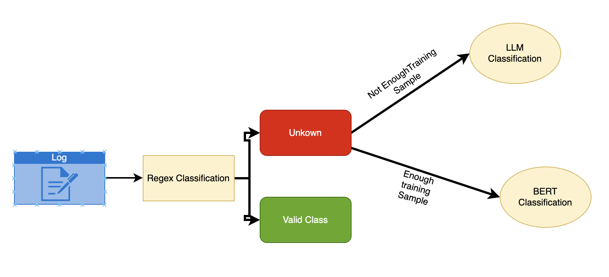

# Log Classification System using GenAI

A multi-method log classification system that uses regex patterns, BERT embeddings, and LLM-based classification to categorize log messages from different sources.


## Features

- **Multi-source log processing**: Handles logs from different systems with source-specific classification strategies
- **Three-tier classification approach**:
  - Regex pattern matching for structured logs
  - BERT-based machine learning classification
  - LLM-powered classification for complex logs (LegacyCRM)
- **FastAPI web service**: RESTful API for batch log classification
- **CSV input/output**: Process logs in CSV format with automatic labeling

## Architecture

The system uses a hierarchical classification approach:

1. **LegacyCRM logs**: Classified using LLM (Groq API)
2. **Other sources**: 
   - First attempt: Regex pattern matching
   - Fallback: BERT-based classification
   - Final fallback: "Unclassified" label

## Installation

1. Clone the repository:
```bash
git clone <repository-url>
cd log-classification-system
```

2. Create and activate virtual environment:
```bash
python -m venv .venv
source .venv/bin/activate  # On Windows: .venv\Scripts\activate
```

3. Install dependencies:
```bash
pip install -r requirements.txt
```

4. Set up environment variables:
```bash
cp .env.example .env
# Add your Groq API key to .env file
```

## Usage

### Running the API Server

```bash
python main.py
```

The FastAPI server will start on `http://localhost:8000`

### API Endpoint

**POST** `/classify/`

Upload a CSV file with columns:
- `source`: Log source system name
- `log_message`: The log message to classify

Returns a CSV file with an additional `target_label` column containing the classification results.

### Input CSV Format

```csv
source,log_message
WebApp,User User123 logged in.
LegacyCRM,Session timeout occurred for user account
Database,Backup started at 2024-01-01 10:00:00
```

### Output CSV Format

```csv
source,log_message,target_label
WebApp,User User123 logged in.,User Action
LegacyCRM,Session timeout occurred for user account,System Notification
Database,Backup started at 2024-01-01 10:00:00,System Notification
```

## Classification Methods

### 1. Regex Classification
Handles structured log patterns:
- User login/logout events
- System notifications (backups, updates, reboots)
- File operations
- Account management

### 2. BERT Classification
Uses sentence transformers and a trained scikit-learn model:
- Model: `all-MiniLM-L6-v2` for embeddings
- Confidence threshold: 0.5 (below threshold = "Unclassified")
- Pre-trained model stored in `data/training/model/`

### 3. LLM Classification
Uses Groq API for complex log analysis:
- Specifically for LegacyCRM logs
- Handles unstructured and complex log formats

## Project Structure

```
log-classification-system/
├── main.py                 # FastAPI application
├── requirements.txt        # Python dependencies
├── .env                   # Environment variables
├── src/
│   ├── classify.py        # Main classification logic
│   ├── processor_regex.py # Regex-based classification
│   ├── processor_bert.py  # BERT-based classification
│   └── processor_llm.py   # LLM-based classification
├── data/
│   └── training/          # Training data and models
│       ├── logs.csv       # Training dataset
│       ├── training.ipynb # Model training notebook
│       └── model/         # Trained models
└── resources/             # Input/output files
    ├── test.csv          # Sample test data
    └── output.csv        # Classification results
```

## Environment Variables

Create a `.env` file with:

```
GROQ_API_KEY=your_groq_api_key_here
```

## Dependencies

- `fastapi`: Web framework for API
- `pandas`: Data manipulation
- `sentence-transformers`: BERT embeddings
- `scikit-learn`: Machine learning models
- `joblib`: Model serialization
- `groq`: LLM API client
- `python-dotenv`: Environment variable management

## Development

### Training New Models

Use the Jupyter notebook in `data/training/training.ipynb` to:
- Prepare training data
- Train new BERT classification models
- Evaluate model performance

### Adding New Regex Patterns

Edit `src/processor_regex.py` to add new patterns:

```python
regex_patterns = {
    r"your_pattern_here": "Your Label",
    # ... existing patterns
}
```

## API Documentation

Once the server is running, visit:
- Swagger UI: `http://localhost:8000/docs`
- ReDoc: `http://localhost:8000/redoc`


